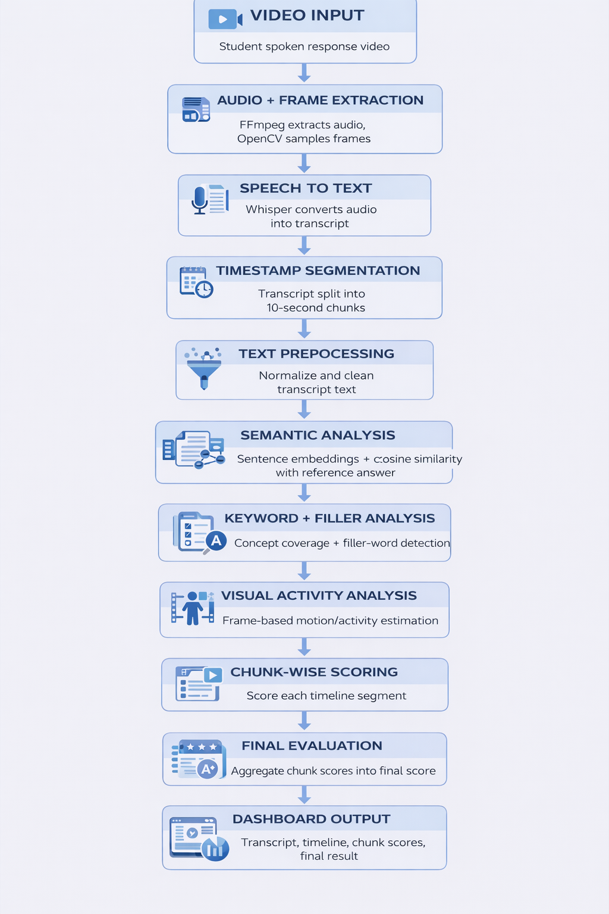
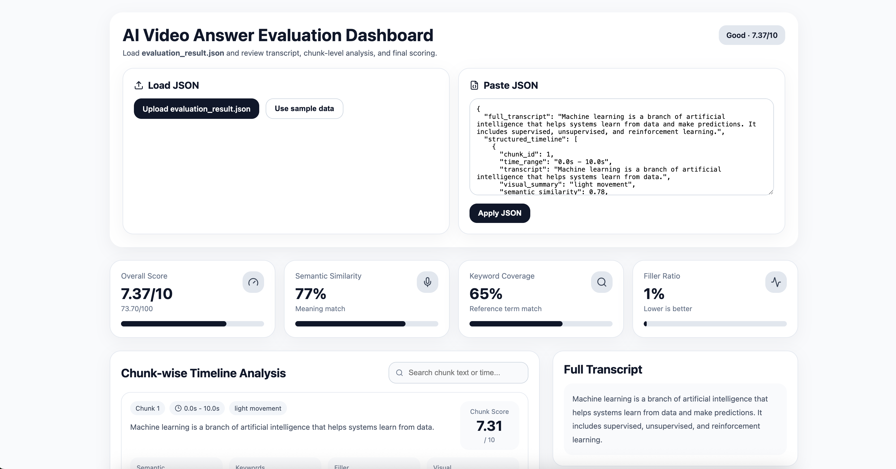
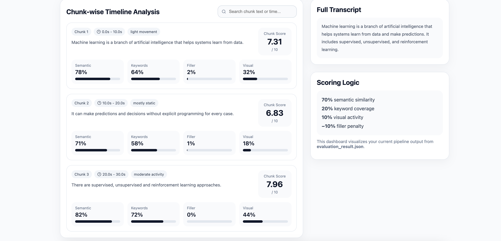

# AI Video Answer Evaluator

An end-to-end AI-based system that evaluates spoken video answers by extracting audio, transcribing speech, analyzing semantic similarity with a reference answer, performing lightweight visual activity analysis, and generating chunk-wise as well as final scores through a dashboard.

---

## Project Overview

This project takes a student's spoken video response as input and processes it through a complete AI evaluation pipeline.

### Evaluation Pipeline

```text

Video Input
↓
Audio Extraction (FFmpeg)
↓
Speech-to-Text (Whisper)
↓
Timestamp Segmentation (10-second chunks)
↓
Reference Answer Loading
↓
Semantic Similarity Analysis
↓
Keyword Coverage + Filler Detection
↓
Visual Activity Analysis (OpenCV)
↓
Chunk-wise Scoring
↓
Final Score Aggregation
↓
Structured Timeline Generation
↓
Dashboard Visualization

The system is designed as a working MVP for hackathon and demo use cases where spoken video answers need to be evaluated automatically.

⸻
```

### Features
	•	Extracts audio from video using FFmpeg
	•	Converts speech to text using Whisper
	•	Splits transcript into timestamp-based chunks
	•	Compares student response with a reference answer using semantic similarity
	•	Measures keyword coverage
	•	Detects filler-word usage
	•	Performs lightweight visual activity analysis from sampled video frames
	•	Generates chunk-wise scores
	•	Produces a final aggregated score
	•	Creates a structured timeline output
	•	Displays results in a React dashboard

⸻

### Tech Stack
```text

Backend
	•	Python
	•	FFmpeg
	•	Whisper
	•	Sentence Transformers
	•	OpenCV
	•	NumPy

Frontend
	•	React
	•	Vite
	•	Framer Motion
	•	Lucide React

```

⸻


### How It Works

```text

1. Video Input

The system accepts a student’s recorded spoken video response.

2. Audio Extraction

FFmpeg extracts mono 16 kHz WAV audio from the video for transcription.

3. Speech-to-Text

Whisper converts the extracted audio into text.

4. Timestamp Segmentation

The transcript is divided into fixed 10-second chunks for section-wise evaluation.

5. Reference Answer Loading

A reference answer is loaded for comparison with the student’s response.

6. Semantic Similarity Analysis

Each chunk is compared with the reference answer using sentence embeddings and cosine similarity.

7. Keyword Coverage and Filler Detection

Important reference keywords are matched against the response, and filler words such as “um”, “uh”, and “like” are counted.

8. Visual Activity Analysis

Sampled video frames are analyzed using OpenCV to estimate movement/activity level in each chunk.

9. Chunk-wise Scoring

Each chunk is scored using weighted factors such as:
	•	semantic similarity
	•	keyword coverage
	•	visual activity
	•	filler-word penalty

10. Final Score Aggregation

All chunk scores are combined into a final overall score.

11. Structured Timeline Generation

The system produces a timeline-based output containing transcript segments, chunk scores, and analysis details.

12. Dashboard Visualization

The frontend dashboard displays transcript, chunk-wise timeline, and final result in a more understandable way.
```

⸻

### Folder Structure
```text
ai-video-answer-evaluator/
├── backend/
│   ├── app.py
│   ├── input/
│   │   ├── reference.txt
│   │   └── .keep
│   ├── output/
│   │   └── .keep
│   └── requirements.txt
│
├── frontend/
│   ├── src/
│   │   ├── App.jsx
│   │   ├── EvaluationDashboard.jsx
│   │   └── index.css
│   ├── package.json
│   └── ...
│
├── screenshots/
│   ├── pipeline.png
│   ├── dashboard.png
│   └── result.png
│
├── .gitignore
└── README.md
```

⸻


Backend Setup

```text

Go to the backend folder:

cd backend

Create and activate a virtual environment:

python3.12 -m venv venv
source venv/bin/activate

Install dependencies:

pip install -r requirements.txt

Make sure FFmpeg is installed system-wide:

ffmpeg -version

Place your input files inside:

backend/input/student.mp4
backend/input/reference.txt

Run the backend pipeline:

python app.py

Generated files will appear in:

backend/output/

```
⸻

Frontend Setup

```text

Go to the frontend folder:

cd frontend

Install dependencies:

npm install
npm install framer-motion lucide-react

Run the frontend:

npm run dev

Open the local URL shown in the terminal.

```

⸻

Output
```text

The backend generates:
	•	transcript output
	•	chunk-wise evaluation data
	•	structured timeline data
	•	final aggregated score

The dashboard displays:
	•	full transcript
	•	chunk-wise timeline analysis
	•	semantic similarity
	•	keyword coverage
	•	filler ratio
	•	visual activity
	•	final score
```

⸻

## Screenshots

### Pipeline


### Dashboard


### Result



⸻

```text

Future Improvements
	•	Direct video upload from frontend to backend
	•	FastAPI integration for real-time evaluation
	•	Better visual behavior analysis
	•	Improved fluency and confidence scoring
	•	More advanced dashboard analytics

```

⸻

Author

Sri Koushik Reddy
